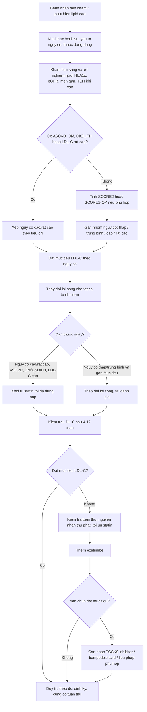

# Đề 6 - Ứng dụng lâm sàng: Tiếp cận bệnh nhân rối loạn lipid máu theo ESC/EAS 2025

*Ngày lập kế hoạch: 14/05/2026*

## 1. Mục tiêu tài liệu

Tài liệu này phân tích yêu cầu đề tài giữa kỳ và đề xuất hướng nghiên cứu, cấu trúc báo cáo, kế hoạch triển khai slide cho chủ đề: **giả định tiếp cận bệnh nhân rối loạn lipid máu trong thực hành lâm sàng**.

Đầu ra cuối cùng cần hướng tới một bài trình bày 30-50 slide, có tính ứng dụng, có flowchart từ khám đến điều trị, có 1 ca lâm sàng hoàn chỉnh gồm 5 slide riêng, và kết thúc bằng 3-5 thông điệp chính.

## 2. Làm rõ phạm vi guideline

Nguồn chính cần dùng là **2025 Focused Update of the 2019 ESC/EAS Guidelines for the management of dyslipidaemias**. Điểm cần lưu ý khi trình bày: đây là **bản cập nhật tập trung năm 2025** dựa trên guideline ESC/EAS 2019, không phải một guideline hoàn toàn mới.

Các điểm 2025 cần ưu tiên đưa vào bài:

- Cập nhật đánh giá nguy cơ bằng SCORE2 và SCORE2-OP cho người chưa có ASCVD rõ, đái tháo đường, bệnh thận mạn hoặc rối loạn lipid/HA di truyền.
- Nhấn mạnh điều trị theo nguy cơ tim mạch tổng thể và mục tiêu LDL-C.
- Bổ sung vai trò của liệu pháp không statin có bằng chứng lợi ích tim mạch: ezetimibe, PCSK9 monoclonal antibodies, bempedoic acid.
- Bempedoic acid được khuyến cáo ở bệnh nhân không dùng được statin để đạt mục tiêu LDL-C, và có thể cân nhắc thêm vào statin tối đa dung nạp có/không có ezetimibe ở nhóm nguy cơ cao hoặc rất cao.
- Lp(a) >50 mg/dL, xấp xỉ 105 nmol/L, nên được xem là yếu tố tăng cường nguy cơ tim mạch ở người trưởng thành.
- Ở hội chứng vành cấp, cần cân nhắc chiến lược điều trị tích cực sớm, gồm tăng cường điều trị trong thời gian nằm viện và có thể khởi trị phối hợp statin cường độ cao + ezetimibe khi dự kiến statin đơn độc không đạt mục tiêu.

Nguồn nền cho mục tiêu LDL-C vẫn lấy từ ESC/EAS 2019 vì bản 2025 là cập nhật tập trung:

| Nhóm nguy cơ | Mục tiêu LDL-C cần trình bày |
|---|---|
| Thấp | LDL-C <116 mg/dL |
| Trung bình | LDL-C <100 mg/dL |
| Cao | LDL-C <70 mg/dL và giảm >=50% so với ban đầu |
| Rất cao | LDL-C <55 mg/dL và giảm >=50% so với ban đầu |

## 3. Phân tích yêu cầu đề bài

### Yêu cầu chung của team

- 30-50 slide.
- 1 case lâm sàng, tách thành 5 slide riêng.
- 1 flowchart tổng kết.
- 3-5 take-home messages.

### Yêu cầu riêng của Đề 6

Đề tài yêu cầu trình bày một quy trình tiếp cận bệnh nhân rối loạn lipid máu. Trọng tâm không phải chỉ mô tả thuốc, mà là **ra quyết định lâm sàng**:

1. Bệnh nhân đến khám thì hỏi gì, khám gì, làm xét nghiệm gì?
2. Phân tầng nguy cơ tim mạch bằng cách nào?
3. Khi nào chỉ thay đổi lối sống, khi nào cần thuốc?
4. Chọn statin, ezetimibe, bempedoic acid, PCSK9 inhibitor/inclisiran trong bối cảnh nào?
5. Theo dõi đáp ứng, tác dụng phụ, tuân thủ và điều chỉnh điều trị ra sao?
6. Khi nào cần chuyển chuyên khoa tim mạch/nội tiết/chuyên lipid?

## 4. Câu hỏi nghiên cứu chính

Để làm báo cáo chắc và có mạch, nhóm nên trả lời 6 câu hỏi nghiên cứu:

1. **LDL-C liên quan thế nào với xơ vữa động mạch và biến cố tim mạch?**
   - Vai trò nhân quả của LDL-C.
   - Nguyên tắc "lower is better" và giảm LDL-C theo nguy cơ.

2. **Bệnh nhân rối loạn lipid máu được đánh giá ban đầu như thế nào?**
   - Tiền sử ASCVD, đái tháo đường, CKD, tăng huyết áp, hút thuốc, tiền sử gia đình.
   - Xét nghiệm lipid máu, glucose/HbA1c, men gan, creatinine/eGFR, TSH nếu nghi nguyên nhân thứ phát.
   - Xác định nguyên nhân thứ phát: suy giáp, hội chứng thận hư, bệnh gan mật, thuốc, rượu, béo phì, đái tháo đường chưa kiểm soát.

3. **Phân tầng nguy cơ và mục tiêu LDL-C ra sao?**
   - Dùng SCORE2/SCORE2-OP ở người phù hợp.
   - Xác định nhóm rất cao/cao/trung bình/thấp dựa trên ASCVD, DM, CKD, FH, SCORE2/SCORE2-OP và yếu tố tăng cường nguy cơ.
   - Gắn mỗi nhóm với mục tiêu LDL-C cụ thể.

4. **Khi nào cần thuốc?**
   - Luôn có thay đổi lối sống.
   - Cần thuốc ngay khi nguy cơ cao/rất cao, ASCVD, LDL-C rất cao, FH, DM/CKD nguy cơ cao, hoặc không đạt mục tiêu sau can thiệp lối sống.
   - Statin là nền tảng nếu không chống chỉ định/không dung nạp.
   - Thêm ezetimibe, bempedoic acid hoặc PCSK9 inhibitor tùy khoảng cách LDL-C còn thiếu, nguy cơ và khả năng dung nạp.

5. **Theo dõi điều trị như thế nào?**
   - Đánh giá LDL-C sau khởi trị hoặc chỉnh liều, thường sau khoảng 4-12 tuần theo thực hành lâm sàng.
   - Theo dõi men gan, triệu chứng cơ, tương tác thuốc, tuân thủ, thay đổi lối sống.
   - Nếu chưa đạt mục tiêu: kiểm tra tuân thủ và nguyên nhân thứ phát, tối ưu liều statin, thêm ezetimibe, sau đó cân nhắc thuốc không statin mạnh hơn.

6. **Làm sao biến guideline thành flowchart dễ nhớ?**
   - Khám ban đầu -> xét nghiệm -> loại trừ nguyên nhân thứ phát -> phân tầng nguy cơ -> đặt mục tiêu LDL-C -> chọn điều trị -> tái kiểm tra -> tăng cường hoặc duy trì.

## 5. Đề xuất cấu trúc slide 30-50 trang

Khuyến nghị chọn khoảng **38-42 slide** để đủ sâu nhưng không quá tải.

### Phần 1 - Mở đầu và nền tảng (5-6 slide)

1. Tiêu đề, thành viên, mục tiêu bài.
2. Vì sao rối loạn lipid máu quan trọng trong thực hành.
3. LDL-C và xơ vữa động mạch: thông điệp nhân quả.
4. ESC/EAS 2025 là bản cập nhật tập trung của guideline 2019.
5. Ba câu hỏi lâm sàng xuyên suốt: đánh giá nguy cơ, khi nào dùng thuốc, theo dõi ra sao.

### Phần 2 - Khám và đánh giá ban đầu (7-8 slide)

6. Bệnh nhân nào cần đánh giá lipid máu?
7. Khai thác bệnh sử và yếu tố nguy cơ.
8. Khám lâm sàng: BMI, vòng bụng, huyết áp, dấu hiệu FH/xanthoma nếu có.
9. Bộ xét nghiệm ban đầu.
10. Tìm nguyên nhân thứ phát.
11. Nhận diện nhóm cần xử trí sớm: ASCVD, LDL-C rất cao, nghi FH, đái tháo đường, CKD.
12. Vai trò Lp(a), hs-CRP, CAC trong tinh chỉnh nguy cơ.

### Phần 3 - Phân tầng nguy cơ và mục tiêu LDL-C (6-7 slide)

13. Nguyên tắc phân tầng nguy cơ tổng thể.
14. SCORE2 và SCORE2-OP: dùng cho ai, không dùng cho ai.
15. Bảng nhóm nguy cơ: thấp, trung bình, cao, rất cao.
16. Bảng mục tiêu LDL-C theo nguy cơ.
17. Ví dụ nhanh: cùng LDL-C nhưng khác nguy cơ -> khác quyết định điều trị.
18. Các tình huống làm tăng mức độ ưu tiên điều trị.

### Phần 4 - Khi nào cần thuốc và chọn thuốc (9-11 slide)

19. Thay đổi lối sống cho tất cả bệnh nhân.
20. Khi nào chỉ theo dõi lối sống, khi nào khởi thuốc.
21. Statin: vai trò nền tảng, cường độ và kỳ vọng giảm LDL-C.
22. Ezetimibe: khi LDL-C chưa đạt mục tiêu hoặc cần phối hợp sớm.
23. Bempedoic acid: vai trò trong không dung nạp statin hoặc cần tăng cường ở nguy cơ cao/rất cao.
24. PCSK9 inhibitor: nhóm rất cao, sau statin + ezetimibe chưa đạt mục tiêu, hoặc cần giảm LDL-C lớn.
25. Inclisiran: cơ chế tiêm định kỳ, thuận lợi về tuân thủ; cần trình bày thận trọng theo mức khuyến cáo/khả dụng.
26. Tăng triglyceride: nhận diện khi nào ưu tiên phòng viêm tụy và khi nào giảm nguy cơ tim mạch.
27. Điều trị trong hội chứng vành cấp: phối hợp sớm, tăng cường trong nhập viện.
28. Không dung nạp statin: cách tiếp cận thực tế.

### Phần 5 - Theo dõi và tăng cường điều trị (5-6 slide)

29. Lịch theo dõi sau khởi trị/chỉnh liều.
30. Đánh giá hiệu quả: LDL-C đạt mục tiêu hay chưa.
31. Đánh giá an toàn: men gan, triệu chứng cơ, tương tác thuốc, phụ nữ có thai.
32. Nếu chưa đạt mục tiêu: thuật toán tăng cường.
33. Theo dõi dài hạn: duy trì, giáo dục, tái đánh giá nguy cơ.

### Phần 6 - Case lâm sàng riêng 5 slide

34. Case slide 1: Bệnh cảnh ban đầu.
35. Case slide 2: Dữ liệu xét nghiệm và nguy cơ.
36. Case slide 3: Phân tầng nguy cơ và mục tiêu LDL-C.
37. Case slide 4: Quyết định điều trị ban đầu.
38. Case slide 5: Theo dõi sau điều trị và tăng cường nếu chưa đạt.

### Phần 7 - Tổng kết (3-4 slide)

39. Flowchart từ khám -> điều trị -> theo dõi.
40. Bảng tóm tắt thuốc và vị trí sử dụng.
41. 3-5 take-home messages.
42. Tài liệu tham khảo.

## 6. Đề xuất case lâm sàng hoàn chỉnh

### Bệnh cảnh đề xuất

Bệnh nhân nam 58 tuổi, hút thuốc 20 gói-năm, tăng huyết áp, đái tháo đường type 2 trong 6 năm, BMI 28 kg/m2. Đến khám vì phát hiện cholesterol cao khi kiểm tra sức khỏe. Chưa có nhồi máu cơ tim hoặc đột quỵ đã biết.

### Dữ liệu ban đầu

- Huyết áp: 145/90 mmHg.
- LDL-C: 172 mg/dL.
- HDL-C: 38 mg/dL.
- Triglyceride: 210 mg/dL.
- HbA1c: 7.8%.
- eGFR: 72 mL/phút/1.73 m2.
- ALT/AST bình thường.
- Không đau cơ nền, không bệnh gan tiến triển.

### Vấn đề lâm sàng

- Bệnh nhân có nhiều yếu tố nguy cơ: tuổi, nam, hút thuốc, tăng huyết áp, đái tháo đường, LDL-C cao.
- Cần phân tầng nguy cơ cao/rất cao tùy tiêu chí chi tiết và có thể dùng SCORE2 nếu phù hợp.
- Mục tiêu LDL-C khả năng là ít nhất <70 mg/dL và giảm >=50%; nếu được xếp rất cao thì mục tiêu <55 mg/dL và giảm >=50%.

### Quyết định điều trị minh họa

- Tư vấn lối sống: ngưng hút thuốc, chế độ ăn kiểu Địa Trung Hải/DASH, giảm mỡ bão hòa/trans fat, vận động, giảm cân, kiểm soát đường huyết và huyết áp.
- Khởi statin cường độ cao nếu không chống chỉ định.
- Hẹn kiểm tra lipid sau 4-12 tuần.
- Nếu LDL-C còn cao hơn mục tiêu: thêm ezetimibe.
- Nếu vẫn chưa đạt, đặc biệt nếu nguy cơ rất cao hoặc khoảng cách LDL-C còn lớn: cân nhắc PCSK9 inhibitor; nếu không dung nạp statin, cân nhắc bempedoic acid hoặc liệu pháp không statin có bằng chứng.

### Điểm học từ case

Case này giúp minh họa đủ 3 yêu cầu của đề:

- Các bước tiếp cận từ khám, xét nghiệm, phân tầng nguy cơ.
- Khi nào cần thuốc: bệnh nhân nguy cơ cao/rất cao và LDL-C cao nên dùng thuốc ngay song song với lối sống.
- Theo dõi điều trị: kiểm tra đạt mục tiêu, an toàn, tuân thủ và tăng cường bậc thang.

## 7. Flowchart tổng kết dự kiến

## 8. Kế hoạch thực hiện cụ thể

### Giai đoạn 1 - Chốt nguồn và khung nội dung

Thời lượng đề xuất: 0.5-1 ngày.

- Tải/đọc nguồn chính ESC/EAS 2025 Focused Update.
- Đối chiếu mục tiêu LDL-C từ guideline ESC/EAS 2019.
- Lập bảng thuốc: statin, ezetimibe, bempedoic acid, PCSK9 inhibitor, inclisiran, icosapent ethyl nếu cần.
- Chốt case lâm sàng và dữ liệu xét nghiệm.

### Giai đoạn 2 - Viết outline chi tiết từng slide

Thời lượng đề xuất: 0.5 ngày.

- Viết tiêu đề từng slide.
- Mỗi slide chỉ giữ 1 thông điệp chính.
- Gắn nguồn cho các slide guideline/khuyến cáo.
- Đánh dấu 5 slide case riêng.

### Giai đoạn 3 - Thiết kế flowchart và bảng quyết định

Thời lượng đề xuất: 0.5 ngày.

- Chuyển flowchart Mermaid thành hình ảnh hoặc sơ đồ trong PowerPoint.
- Làm bảng mục tiêu LDL-C theo nguy cơ.
- Làm bảng "khi nào thêm thuốc".

### Giai đoạn 4 - Soạn slide bản nháp

Thời lượng đề xuất: 1 ngày.

- Tạo slide theo cấu trúc 38-42 trang.
- Dùng màu nhất quán: nhóm nguy cơ thấp/trung bình/cao/rất cao.
- Giữ định dạng lâm sàng, ưu tiên thuật toán, bảng và case thay vì quá nhiều chữ.

### Giai đoạn 5 - Kiểm tra chuyên môn và diễn tập

Thời lượng đề xuất: 0.5-1 ngày.

- Kiểm tra lại đơn vị mg/dL và mmol/L nếu có.
- Kiểm tra các ngưỡng LDL-C, Lp(a), triglyceride.
- Kiểm tra slide case có logic từ dữ liệu -> nguy cơ -> mục tiêu -> điều trị -> theo dõi.
- Rút gọn nếu vượt 50 slide.
- Chuẩn bị lời dẫn 8-12 phút hoặc theo thời lượng lớp yêu cầu.

## 9. Phân công công việc gợi ý cho team

| Vai trò | Nhiệm vụ |
|---|---|
| Người 1 | Nghiên cứu guideline, mục tiêu LDL-C, SCORE2/SCORE2-OP |
| Người 2 | Soạn phần khám ban đầu, xét nghiệm, nguyên nhân thứ phát |
| Người 3 | Soạn phần điều trị thuốc và theo dõi |
| Người 4 | Xây dựng case lâm sàng 5 slide |
| Người 5 | Thiết kế flowchart, chỉnh slide, thống nhất hình ảnh |

Nếu team ít người, có thể gộp vai trò 4 và 5.

## 10. Take-home messages dự kiến

1. Rối loạn lipid máu cần được xử trí theo **nguy cơ tim mạch tổng thể**, không chỉ nhìn một con số LDL-C đơn lẻ.
2. **LDL-C là mục tiêu điều trị chính**; nhóm nguy cơ càng cao thì mục tiêu LDL-C càng thấp và thường cần giảm >=50% so với ban đầu.
3. **Lối sống áp dụng cho tất cả bệnh nhân**, nhưng nhóm nguy cơ cao/rất cao thường cần thuốc sớm.
4. Điều trị nên theo bậc thang: statin tối đa dung nạp -> thêm ezetimibe -> cân nhắc bempedoic acid/PCSK9 inhibitor hoặc liệu pháp phù hợp nếu chưa đạt mục tiêu.
5. Theo dõi sau điều trị phải đánh giá đồng thời: đạt mục tiêu LDL-C, tuân thủ, an toàn thuốc và nhu cầu tăng cường điều trị.

## 11. Nguồn tham khảo chính

1. European Society of Cardiology. **2025 Focused Update of the 2019 ESC/EAS Guidelines for the management of dyslipidaemias**. https://www.escardio.org/guidelines/clinical-practice-guidelines/all-esc-practice-guidelines/dyslipidaemias/
2. Mach F, et al. **2025 Focused Update of the 2019 ESC/EAS Guidelines for the management of dyslipidaemias**. *European Heart Journal*. https://academic.oup.com/eurheartj/article/46/42/4359/8234482
3. European Atherosclerosis Society. **What is new in the updated ESC/EAS Dyslipidaemia Guidelines?** https://eas-society.org/publications/guidelines/2025-focused-update-of-the-2019-esc-eas-guidelines-for-the-management-of-dyslipidaemias/
4. European Society of Cardiology. **Official slide set: 2025 Focused Update of the 2019 ESC/EAS Guidelines for the management of dyslipidaemias**. https://www.escardio.org/static-file/Escardio/Guidelines/Products/Slide%20sets/2025/2025%20official%20slides_Dyslipidaemias.pdf
5. American College of Cardiology. **2019 ESC/EAS Guidelines for Management of Dyslipidemias: Ten Points to Remember**. https://www.acc.org/latest-in-cardiology/ten-points-to-remember/2019/09/12/15/13/2019-esc-eas-guidelines-for-dyslipidaemias

