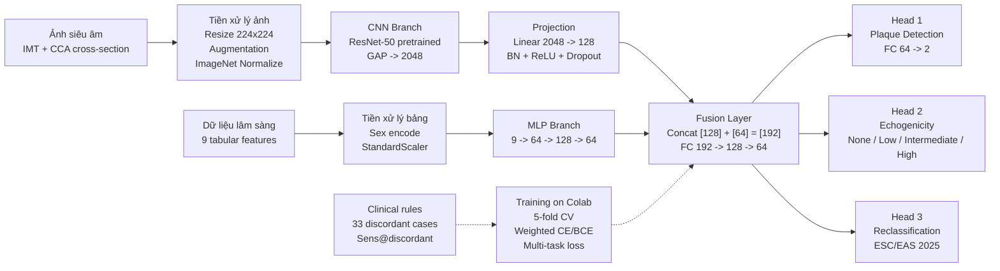

# Hướng Dẫn Thiết Kế Hình Kiến Trúc Model

File hình đã tạo:

```text
docs/model_architecture_diagram.svg
```

Bạn có thể mở trực tiếp file SVG bằng trình duyệt, chèn vào PowerPoint/Google Slides, hoặc import vào Figma/Canva/diagrams.net để chỉnh tiếp.

---

## 1. Nội Dung Sơ Đồ

Sơ đồ mô tả đúng kiến trúc project hiện tại:

```text
Ảnh siêu âm
-> Tiền xử lý ảnh
-> ResNet-50
-> Projection 2048 -> 128
-> Image embedding

Dữ liệu lâm sàng
-> Encode + StandardScaler
-> MLP Branch
-> Clinical embedding

Image embedding + Clinical embedding
-> Fusion Layer
-> 3 output heads
```

Ba output heads:

```text
Head 1: Plaque Detection
Head 2: Echogenicity Classification
Head 3: Reclassification theo ESC/EAS 2025
```

Phần dưới cùng thể hiện luồng chạy Colab:

```text
5-fold CV
Weighted CE/BCE
Multi-task loss
AUC, F1, Sens@discordant
```

---

## 2. Tool Nên Dùng Để Thiết Kế Lại Cho Slide

### Lựa chọn nhanh nhất: diagrams.net

Link:

```text
https://app.diagrams.net/
```

Cách dùng:

1. Mở diagrams.net.
2. Chọn `File -> Import From -> Device`.
3. Chọn `docs/model_architecture_diagram.svg`.
4. Chỉnh màu, font, vị trí box nếu cần.
5. Export sang PNG/PDF/SVG.

Phù hợp nếu bạn muốn sơ đồ giống ảnh mẫu: nhiều box, mũi tên, nền grid.

### Lựa chọn đẹp cho slide: Figma

Link:

```text
https://figma.com/
```

Cách dùng:

1. Tạo file Figma mới.
2. Kéo thả `model_architecture_diagram.svg` vào canvas.
3. Chỉnh typography, màu sắc, border.
4. Export PNG độ phân giải cao.

Phù hợp nếu bạn muốn hình đẹp, hiện đại, đưa vào báo cáo hoặc poster.

### Lựa chọn đơn giản: Canva

Link:

```text
https://canva.com/
```

Phù hợp nếu bạn muốn làm slide nhanh, kéo thả, không cần chỉnh kỹ thuật nhiều.

### Lựa chọn kỹ thuật: Mermaid

Dùng khi bạn muốn sơ đồ nằm trực tiếp trong Markdown/GitHub.

Mermaid source:



Bạn có thể paste đoạn trên vào:

```text
https://mermaid.live/
```

rồi export SVG/PNG.

---

## 3. Gợi Ý Khi Trình Bày Hình

Nói theo flow sau:

```text
Đầu vào có hai modality:
1. Ảnh siêu âm động mạch cảnh.
2. Dữ liệu lâm sàng dạng bảng.

Ảnh đi qua ResNet-50 để lấy image embedding.
Dữ liệu bảng đi qua MLP để lấy clinical embedding.
Hai embedding được hợp nhất bằng Fusion Layer.
Sau Fusion, model dự đoán 3 đầu ra:
Plaque, Echogenicity, và Reclassification theo ESC/EAS 2025.

Điểm mới là model không chỉ phát hiện plaque,
mà còn nhắm vào nhóm discordant: bệnh nhân đạt LDL-C goal
nhưng vẫn có risk modifier như Lp(a) cao hoặc plaque.
```

